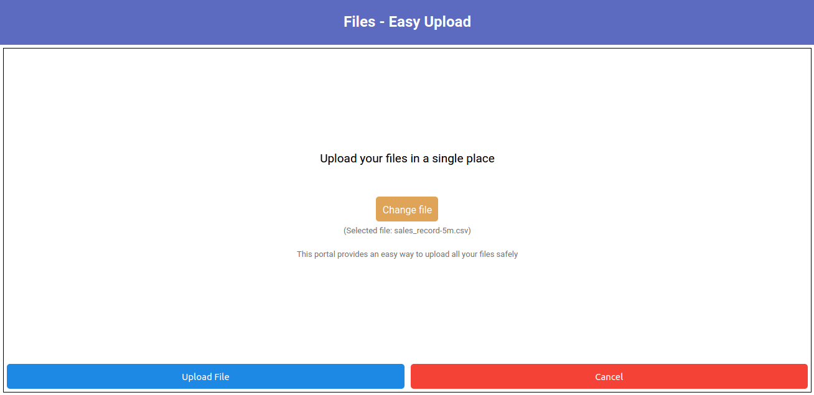
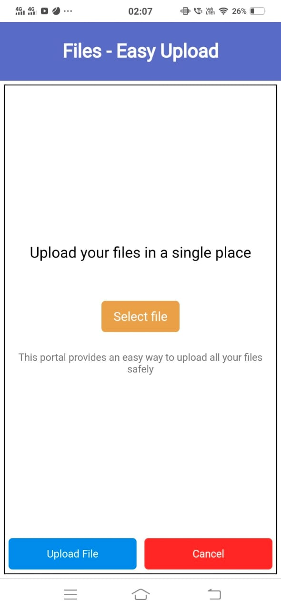

# File Upload App

This portal provides an easy way to upload all your files to server, allows to pause/resume or cancel the upload in case of an erroneous upload.

## Front End (Desktop and Mobile view)

## Steps to run the project

###### Clone the repo
`git clone https://github.com/gau1rav/File-upload-app`

###### Move into working directory
`cd your_dir`

###### Install dependencies
`npm install`

###### Start the development server
`npm start`

Visit `http://localhost:3000` to view the app in browser

**Note: You can configure the server address by updating src/IPconfig.js accordingly. It is set to localhost:3001 for now, configure the address according to your need*

## Learn More

You can learn more in the [Create React App documentation](https://facebook.github.io/create-react-app/docs/getting-started).

To learn React, check out the [React documentation](https://reactjs.org/).
